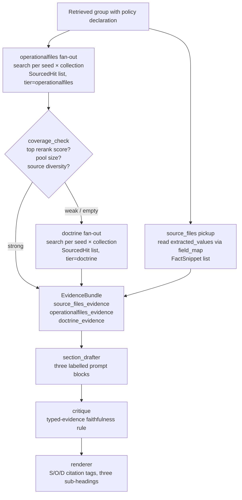

# Tiered Retrieval — Final Plan v5 (locked naming + Phase 0 physical rename)

> Captured from a multi-round Claude/Codex planning conversation.
> Locked naming, locked behavior, locked phase ordering. No code yet.
> Future sessions: read this file end-to-end before touching `graph/generation/`.

---

## The idea in one paragraph

A retrieved group asks the **operationalfiles** Qdrant collection first
(today's content under `inputs/doctrine/`, to be renamed to
`inputs/operationalfiles/` in Phase 0). If those hits are weak, thin, or not
detailed enough, the system falls back to a **doctrine** library (a future
Qdrant collection holding doctrinal reference material — not yet ingested,
but supported by the architecture from day one). Independent of either path,
**source_files** (uploaded WARNO + intel report, the existing extractor path)
can feed scenario facts into the same retrieved group when the YAML maps them
in. The drafter sees up to three labelled prompt blocks, never merged.
Critique judges the draft against typed-evidence rules so doctrine cannot
silently vouch for mission-specific facts.

---

## The three evidence channels (locked names)

| name | what it is | how it's accessed | role |
|---|---|---|---|
| `source_files` | Uploaded WARNO, intel report, extras | Existing `source_file_extractor.py` — no Qdrant | Mission scenario facts; also feeds today's `source_file_extracted` field-kind unchanged |
| `operationalfiles` | Qdrant collection ingested from `inputs/operationalfiles/` (after Phase 0 rename) | Phase 2 `search()` | Default first-search target for retrieved groups |
| `doctrine` | Future backend reference library, not yet ingested | Phase 2 `search()` against a new collection | Fallback when operationalfiles coverage is weak; pure no-op until ingested |

**`source_file_extracted` field-kind is untouched.** It remains the right
answer for fields whose value is a verbatim copy from uploaded files (today:
50 WARNO fields, time_analysis fields). The new tiered retrieval path is for
`retrieved`-kind groups that need to draft prose combining channels.

---

## Flow diagram



`source_files` flows independently of the coverage check. `doctrine` is a
no-op until that library is actually ingested. Coverage check is pure
arithmetic on operationalfiles rerank output — no LLM, deterministic, cheap.

---

## Coverage check — how the system decides "not detailed enough"

Three signals, all tunable via `.env`:

| signal | default | meaning |
|---|---|---|
| top rerank score | `≥ 0.30` | best hit is actually relevant |
| pool size | `≥ 8` hits after merge+rerank | enough material to draft from |
| source diversity | `≥ 2` distinct source_doc values | answer isn't from one chunk of one file |

`strong` = all three pass → no doctrine fallback. `weak` = at least one fails
→ doctrine fans out. `empty` = pool empty → doctrine fans out. Conservative
on purpose: cheap to over-fire fallback, expensive to under-fire it.

LLM-based coverage check is a clean future extension at the same return-type
interface. Out of scope for v1.

---

## Policies

```
source_files_only
operationalfiles_only
doctrine_only
operationalfiles_then_doctrine     ← DEFAULT
operationalfiles_and_doctrine
all_channels                        ← source_files + operationalfiles + doctrine
```

`source_files` is added to any policy by also declaring a
`source_files_field_map:` in the group's YAML. Treated as an additive context
layer, not a competing retrieval direction.

---

## Drafter prompt structure

Up to three labelled blocks; any can be absent:

```
[FACTS FROM UPLOADED SOURCE FILES]
  - <field>: <text>  [S: warning_order.docx §extracted]

[OPERATIONAL FILES]
  - <chunk>  [O: <source_doc> §<locator>]

[DOCTRINE REFERENCE LIBRARY]
  - <chunk>  [D: <source_doc> §<locator>]
```

**Drafter system prompt locks the same typed-evidence rule that critique
enforces** — prevent mismatches at draft time, not just catch them after:

- Mission-specific claims (units, persons, places, times, identifiers,
  scenario facts) must come from `source_files` or `operationalfiles`.
- Reference/library claims (concepts, definitions, standards, procedures,
  doctrinal framing) come from `doctrine`.
- Cite at least one bracket tag per output sentence.
- Never introduce a named entity that does not appear verbatim in
  `source_files` or `operationalfiles`.

---

## Critique rule (typed evidence)

A claim is judged by **type first**, then evidence:

- **Mission-specific entities, identifiers, locations, timings, scenario
  facts** → must be supported by `source_files` OR `operationalfiles`.
  Doctrine alone is **not enough** to validate these.
- **Concepts, definitions, standards, procedures, doctrinal framing** →
  supported by `doctrine`.
- A sentence **fails** when its claim type does not match a permitted
  evidence channel.
- A sentence without any bracketed citation fails.
- Per-field escape hatch (deferred): a future YAML field option could
  explicitly allow doctrine to vouch for entities in narrowly-justified
  cases. Not built in v1.

The LLM critique pass classifies each claim as mission-specific or
doctrinal-reference, then checks against the channel set allowed for that
type. One LLM call. A cheap pre-flag (string-membership over allowed
channels per claim type) optionally narrows what the LLM looks at.

---

## Citation tags — gated emission

Today's tags are `[<source_doc> §<locator>]` (no tier prefix). The new
tier-prefixed format is **opt-in via YAML, not automatic**:

- `[S: <kind> §extracted]` — source_files
- `[O: <source_doc> §<locator>]` — operationalfiles
- `[D: <source_doc> §<locator>]` — doctrine

Rule: a group emits the new prefixed tags only when its resolved policy
comes from a tier-aware YAML key (`policy:`, `operationalfiles_collections:`,
`doctrine_collections:`, `source_files_field_map:`). Groups that resolve via
the legacy `collections:` key keep emitting today's untagged shape.

Renderer reads both shapes during the transition. Endnote layout:

- Mixed templates (some groups tier-aware, others legacy) render the
  three-sub-heading layout; legacy untagged tags get grouped under "مصادر"
  without a sub-heading.
- Pure-legacy templates render exactly as today — no sub-headings, no
  behavior change.

This keeps phases 1–6 behavior-preserving in the strict sense: existing
templates produce the same resolved fields, the same citations, and the
same rendered behavior until their YAML is edited.

---

## Data types

- **`FactSnippet`** — small dataclass: `(field_name, text,
  source_file_kind, source_file_sha256)`. Carries one extracted scenario
  fact. Not a Qdrant hit. Never reranked.
- **`EvidenceBundle`** — three named channels: `source_files_evidence`,
  `operationalfiles_evidence`, `doctrine_evidence`, plus
  `coverage_verdict`, `tiers_consulted`, `provenance`. What the drafter,
  critique, and renderer all consume.
- **`SourcedHit`** (already exists) — gains additive
  `tier: Literal["operationalfiles","doctrine"]` (default `"operationalfiles"`).

---

## Where the code goes (Phase 3 only)

| file | change |
|---|---|
| `graph/generation/evidence.py` (new) | `FactSnippet`, `EvidenceBundle`, builder |
| `graph/generation/assembler.py` | reorder so source_files extraction runs before retrieval **only when needed** |
| `graph/generation/retrieval_group.py` | operationalfiles fan-out with tier tagging, coverage check, conditional doctrine fan-out, gated citation tag emission |
| `graph/generation/section_drafter.py` | three labelled prompt blocks, typed-evidence drafting rules |
| `graph/generation/critique.py` | three-way evidence input, typed-evidence faithfulness rule |
| `graph/generation/cache.py` | extend `GroupCacheKey` with source_files provenance |
| `graph/generation/renderers/arabic_docx.py` | parse both old and new tag formats; conditional three-sub-heading endnote |
| YAML templates | additive optional keys: `policy`, `operationalfiles_collections`, `doctrine_collections`, `source_files_field_map`, `coverage_thresholds`. `collections:` unchanged |
| `.env` | new optional knobs for default policy, coverage thresholds, kill-switch |

Phase 1 (ingestion) and Phase 2 (`search()`) are not touched.

---

## Implementation order — 8 phases (0 prep, then 7 feature)

Each phase is independently mergeable. Tiering only "turns on" at Phase 7,
so Phases 0–6 are quiet refactors with no behavior change.

### Phase 0 — physical rename of operationalfiles corpus

**Goal.** Align the physical Qdrant collection name with the new conceptual
vocabulary so future readers don't have to mentally swap "doctrine" →
"operationalfiles" when reading code or peeking at Qdrant.

**Why before Phase 1.** Tiering would otherwise hardcode the
operationalfiles tier label against a physically-named-`doctrine`
collection — the inversion the rename was supposed to eliminate. Doing the
rename first means YAML, code identifiers, citations, and physical paths
all line up.

**Steps (in order):**

1. **Rename input folder.**
   `inputs/doctrine/` → `inputs/operationalfiles/`. Files inside (FM-6-0,
   FM-5-0, ADP-5-0, ADP-2-0) untouched.
2. **Re-ingest.** Run `python main.py`. Phase 1's folder→slug rule produces
   the new Qdrant collection `ingest__operationalfiles__bgem3` (note: double
   underscore separators, `bgem3` suffix per the Phase 1 naming convention).
   Expected behavior:
   - `initialpages_convert` and `check_documents` cache-hit on existing
     `output/<doc_stem>/` artefacts (sha256 unchanged) — no LLM gate calls,
     no full-page OCR retry needed for ADP-2-0.
   - `convert_document` / `chunk_document` / `enrich_chunks` /
     `embed_chunks` all cache-hit for the same reason.
   - `upsert_to_qdrant` creates the new collection from cached embeddings —
     fast (single-digit minutes).
   - `_registry` gains a new entry for `ingest__operationalfiles__bgem3`.
   - Old `ingest__doctrine__bgem3` collection persists in Qdrant
     (untouched — its source folder no longer exists at the original path,
     but Phase 1 doesn't sweep orphaned collections).
3. **Parity check.** `python scripts/peek_qdrant.py` against both
   collections. Confirm chunk counts match (expected: 2398 total — FM-5-0
   = 1145, FM-6-0 = 678, ADP-5-0 = 342, ADP-2-0 = 233). If the new
   collection's count differs, investigate before proceeding.
4. **Update YAML references.** Find/replace `ingest__doctrine__bgem3` →
   `ingest__operationalfiles__bgem3` across all template files:
   - `prompts/time_analysis/template.yaml`
   - `prompts/initial_planning_guidance/template.yaml`
   - `prompts/staff_brief/template.yaml`
   - `prompts/warning_order/template.yaml`
   - `templates/operation_order.yaml`
   - `templates/staff_estimate.yaml`
   Plus any seed lookups in
   `data/eval/cross_ref_prefixes_unseen.txt`-style auxiliary files (review
   before changing — the eval data is keyed by collection in some places).
5. **Smoke retrieval against the new collection.**
   `python scripts/retrieval_smoke_test.py` (it auto-discovers via
   `_registry` so should pick up the renamed collection without flag
   changes). All 8 checks must pass.
6. **End-to-end smoke.**
   `python scripts/generate_documents.py --warning-order ... --intel-report ... --docs time_analysis initial_planning_guidance staff_brief warning_order --out /tmp/phase0_smoke`.
   Expected: 4/4 `.docx` + 4 `*.fields.json` produced; resolved fields
   identical to a pre-rename baseline run; cache invalidates because
   `operationalfiles_collections_tag` changed (treat as a one-time
   rebuild, not a regression).
7. **Delete old collection.** Once steps 3–6 pass, drop
   `ingest__doctrine__bgem3` from Qdrant (CLI:
   `python -c "from qdrant_client import QdrantClient; QdrantClient('localhost', port=6333).delete_collection('ingest__doctrine__bgem3')"`,
   or via the Qdrant dashboard at `localhost:6333/dashboard`). Also remove
   its `_registry` entry.
8. **Decide on auxiliary renames** (optional, recommend deferring to a
   later cleanup pass):
   - `data/doctrine/` (the termbase: `acronyms.csv`,
     `classification_markings.txt`, `cross_ref_prefixes.txt`) — these are
     **doctrinal vocabulary** in the linguistic sense (military acronyms,
     classification markings), not tier-specific. Recommend keeping the
     name `data/doctrine/` to reflect what they actually are.
   - `graph/doctrine_vocab.py` — same reasoning. Recommend keeping.
   - `inputs/doctrine/.gitkeep`-style placeholders if any — clean up
     opportunistically.

**Acceptance.** Same resolved fields, same citations, same rendered behavior
on `scripts/generate_documents.py` end-to-end run. New collection exists
under the new name. Old collection deleted. YAML references updated. Smoke
tests pass.

**Estimated cost.** ~10–15 minutes wall-clock if cache hits hold; ~30
minutes if any artefact's sha256 has drifted and triggers re-parse.

**Rollback.** Restore `inputs/doctrine/` from git, leave the new collection
in place (won't hurt anything), revert YAML changes. The old
`ingest__doctrine__bgem3` collection is still in Qdrant until step 7, so
the system remains operational throughout the rename.

**Future doctrine library.** With `ingest__doctrine__bgem3` freed up, the
future doctrine library will naturally take that name when ingested
(folder `inputs/doctrine/` → slug `doctrine` → collection
`ingest__doctrine__bgem3`). Clean alignment, no `_lib` suffix needed.

### Phase 1 — hoist source_files extraction above retrieval, conditionally

Run `extract_for_document()` before `run_retrieval_phase()` only when:
- the template declares `source_file_extracted` fields, OR
- any group declares a tier policy or `source_files_field_map` that consumes
  source_files evidence.

Otherwise skip extraction entirely. Templates with neither — pure
operationalfiles_only retrieval — incur zero extractor cost.

Behavior-preserving for every existing template.

### Phase 2 — add `FactSnippet` and `EvidenceBundle`

New module `graph/generation/evidence.py`. Three named channels in the
bundle. Pure builder function. Nothing uses it yet.

### Phase 3 — drafter consumes `EvidenceBundle`

`section_drafter` accepts `EvidenceBundle`, emits up to three labelled
prompt blocks, locks the typed-evidence drafting rules. Until Phase 7, all
non-operationalfiles channels are empty for legacy templates → output
unchanged.

### Phase 4 — critique consumes `EvidenceBundle` with typed-evidence rule

`graph/generation/critique.py` swaps `_format_chunks(retrieval)` for
`_format_evidence(bundle)`. Three-way faithfulness rule applied.
**Must ship together with Phase 3** — otherwise faithfulness checking is
broken for any group with non-operationalfiles evidence.

### Phase 5 — extend `GroupCacheKey` with source_files provenance

Two new fields:
- `source_evidence_sha256` — sha256 over canonical-JSON of the
  `source_files_field_map` subset of `extracted_values`. Empty subset →
  hash of `{}`.
- `source_files_sha256_pairs` — tuple of `(kind, sha256)` for every source
  file the upstream extractor consumed.

Plus the v5-listed tier-policy / collections / coverage-threshold tags.

Canonicalization rule: sort dict keys lexicographically, NFC-normalize
Arabic strings, stable JSON serializer. Pin in `cache.py` docstring.

### Phase 6 — renderer learns both tag formats and conditional sub-heading layout

Parse both `[<source_doc> §<locator>]` and `[S/O/D: ...]` shapes. Emission
of new tags stays **gated by YAML opt-in** — groups using legacy
`collections:` keep emitting untagged tags. Pure-legacy templates render
exactly as today.

### Phase 7 — YAML tier policies go live

Templates can now declare:
- `policy: <one of six values>`
- `operationalfiles_collections: [...]`
- `doctrine_collections: [...]`
- `source_files_field_map: { drafter_field: extracted_values_key }`
- `coverage_thresholds: {...}`

Existing `collections:` unchanged. When no tier-aware key is declared,
loader infers `policy=operationalfiles_only` and treats `collections:` as
the operationalfiles target. Legacy templates produce same resolved fields,
same citations, same rendered behavior.

The future doctrine reference library is **not** built by this plan. When
that corpus is ingested through the existing Phase 1 pipeline (folder
`inputs/doctrine/` → freed up by Phase 0 → slug `doctrine` → collection
`ingest__doctrine__bgem3`), templates can list it under
`doctrine_collections:` and the fallback flow becomes live.

---

## Testing per phase

| phase | acceptance check |
|---|---|
| 0 | Same resolved fields/citations on end-to-end smoke; new collection exists with correct chunk count; old collection deleted; smoke tests pass against new name |
| 1 | Extraction runs before retrieval when needed; skipped when not; existing templates produce same resolved fields/citations |
| 2 | Build `EvidenceBundle` standalone from synthetic group result + dict |
| 3 | Drafter prompt contains exactly the labelled headers; source_files text never appears inside operationalfiles or doctrine blocks |
| 4 | Critique passes when mission entity is in source_files or operationalfiles; fails when entity exists only in doctrine; passes when doctrinal claim is in doctrine |
| 5 | Edit one byte in a source file → affected groups rebuild from cache, unaffected hit cache; toggle policy or `LLM_BASE_URL` → everything rebuilds |
| 6 | Render fixtures with each combination of channels; sub-headings appear/hide correctly; both old and new tag formats render |
| 7 | Six policy fixtures; coverage gate fires doctrine fallback when operationalfiles weak; legacy YAML back-compat preserved; typed-evidence lint catches doctrine-only-supported entities; doctrine collection unreachable still produces output |

End-to-end smoke (after every phase): existing
`scripts/generate_documents.py` against the live stack still produces 4/4
`.docx` + 4 `*.fields.json` with the same resolved fields, with kill-switch
on or off.

---

## Risks worth keeping in mind

- **Phase 0 cache invalidation.** Renaming the collection triggers a
  one-time cache rebuild because `operationalfiles_collections_tag`
  changes. Expected and harmless, but flag it in the commit message so
  reviewers don't read it as a regression.
- **Phases 3 and 4 must ship together.** A drafter that sees evidence
  the critique doesn't would silently weaken faithfulness checking.
- **Three policies with `_only` suffix could be confused for each other**
  (`source_files_only`, `operationalfiles_only`, `doctrine_only`). Loader
  rejects typos with a clear error listing the six valid values.
- **Coverage threshold tuning is template-dependent.** Defaults are
  educated guesses; iteration is fast because cache invalidates on
  threshold flips.
- **Cache canonicalization is fiddly.** Hashing extracted Arabic strings
  needs sorted keys + NFC normalization + stable JSON. Documented in
  `cache.py` on day one.
- **Cache invalidation ≠ retrieval skipping.** Plan makes cache *correct*,
  not faster on re-runs of Qdrant fan-out. A retrieval-skipping cache is
  a separate larger refactor.
- **Typed-evidence critique is conservative.** Doctrine cannot vouch for
  entities by default — protects against fabrication, may reject some
  legitimate edge cases. Per-field escape hatch is a deferred follow-up.
- **Doctrine library is a no-op until ingested.** Templates declaring
  `doctrine_collections: [<not-yet-ingested>]` get a runtime warning
  rather than silent zero-hit fan-out.
- **`data/doctrine/` and `graph/doctrine_vocab.py` keep their names.**
  These are doctrinal-vocabulary tools (military acronyms, classification
  markings), not tier-specific. Conceptually-vs-physically aligned at the
  Qdrant collection level after Phase 0; auxiliary-tool naming kept for
  semantic accuracy.

---

## Explicitly NOT in scope

- Renaming `data/doctrine/`, `graph/doctrine_vocab.py`, or other
  doctrinal-vocabulary tooling. They keep their names because they
  describe *content type* (acronyms, classification markings), not tier.
- Ingesting the future doctrine reference library. Use existing Phase 1
  pipeline against a new folder once Phase 0 frees the slug.
- Changes to `search(SearchRequest)`, Phase 2 stack, Phase 1 nodes,
  `source_file_extracted` field-kind, or `collections:` YAML key.
- Retrieval-skipping cache — separate larger refactor.
- Extractor cache — clean follow-up.
- LLM-based coverage check — current design is arithmetic; LLM gate is a
  future extension at the same return-type interface.
- Per-field doctrine-vouches-for-entities escape hatch — deferred until
  a real template needs it.

---

## Optional follow-ups (not part of this plan)

1. **Extractor cache.** sha256-keyed cache on `extract_for_document()`
   keyed on `(template_id, source_files_sha256_pairs, extractor_model,
   extractor_temperature, extractor_prompt_sha256)`.
2. **Retrieval-skipping cache.** Refactor `run_retrieval_phase` to
   compute a probe cache key before calling `retrieve_group`. Cuts
   re-run latency from seconds to milliseconds.
3. **Hidden / context-only extraction.** A new YAML `context_extraction:`
   list per template for source-files context that isn't an output field.
4. **LLM-based coverage check.** Same return-type interface, LLM judges
   whether retrieved chunks plausibly answer the seed.
5. **Per-field doctrine-vouches-for-entities escape hatch.** Narrowly
   justified cases where doctrine should be allowed to validate a named
   entity (e.g. a doctrinal example referenced in the draft).
6. **Auxiliary-path renames.** `data/doctrine/` →
   `data/doctrine_vocab/`, `graph/doctrine_vocab.py` →
   `graph/term_vocab.py`. Cosmetic; defer until someone is bothered.

---

**End of plan v5.** Locked naming (`source_files`, `operationalfiles`,
`doctrine`). Locked flow (operationalfiles first, doctrine fallback,
source_files independent). Locked critique (typed-evidence). Locked
citation gating (YAML opt-in). Locked phase order (0 prep, then 1–7 feature).
