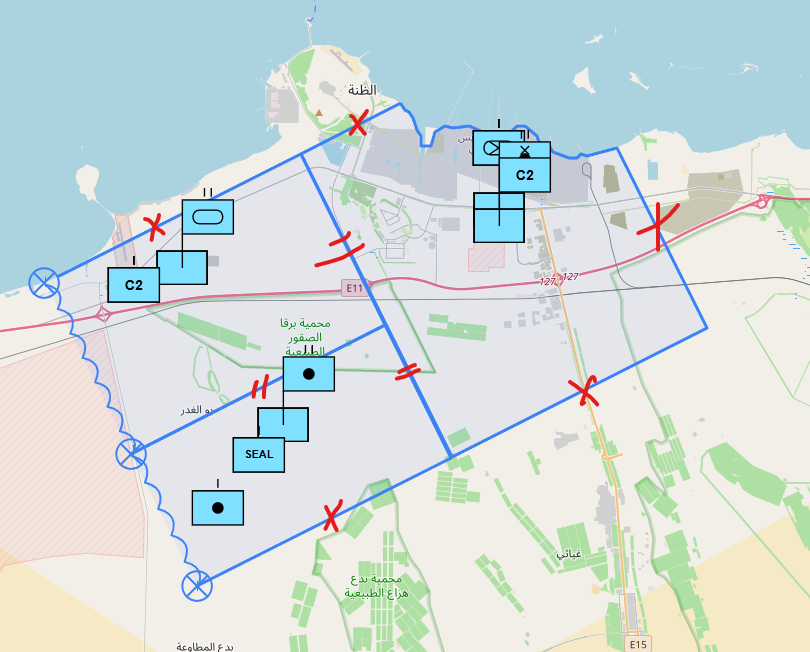

1. Auto Draw Middle line [Lahej]
2. Snap to green dotted point[Ghanem]
3. Coordinates on tghe side of the screen[Lahej]
4. Remove info center top of the screen[Lahej]
5. add page for adding units [Lahej]
10. create OPORD Diagram [Ghanem]
13. old data must be deleted if click clear layer [Ghanem]
17. message that apear in auto draw apears in english even if i change the language [Ghanem]
18. snap to the cnter of the (x) point [Ghanem]
25. adding hide button to the side bar to use the map more [Ghanem]
26. offline enviroment [Lahej]
12. when zooming the units level change[Lahej]

-----------------------------------------------------
27. remove empty rectangle when postioning units[Lahej]

14. if symbol is droped outside the AOI it is not command
15. user must be able to cancel placemnt[Lahej]
16. unit postion must not overlap
------------------------------------------------------------
6. Troops location choose
7. add critical areas
8. update obstacle areas
9. create auto draw custom polygon
11. add viewshed
19. Make it secure and add safety procedure in case of lost 
20. need to check if they need synronus user chating 
21. Audit log not present
22. RBAC for user aceess is  not present 
23. Auto backup for database
24.    to automate this image based on the unit type 
