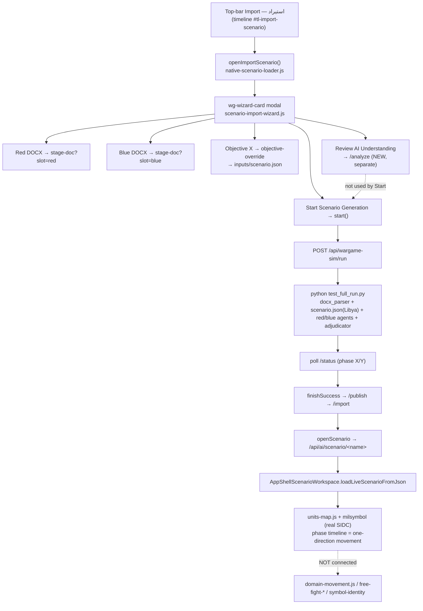

# Import Scenario — legacy flow audit (IMPORT-SCENARIO-LEGACY-FLOW-AUDIT-A)

**Audit only — no code changed, nothing committed/pushed.** Method: Graphify query over the
graph (`graphify-out/graph.json`) + direct code reading. Goal: map exactly what the old
*Import Scenario* flow does (top-bar **Import → استيراد** modal with Red/Blue DOCX + Objective X
+ **Start Scenario Generation**) before any change.

> TL;DR — The Import Scenario modal drives the **WarGamingGEN Python generator** (a real,
> separate, older pipeline): stage Red/Blue DOCX → `POST /api/wargame-sim/run` →
> `python tests/test_full_run.py` (parses DOCX, runs LLM red/blue agents + adjudicator over a
> sample `scenario.json`) → publish → import → open in the scenario workspace via the **real
> units-map / milsymbol** renderer and **phase timeline**. **It bypasses the entire new
> reviewed stack** (operational_brief, placement_candidates, unit-intel-normalizer,
> symbol-identity, sidc-preview, free-fight-ai, domain-movement). The "one-direction movement"
> is the **generated scenario's phase playback**, not Free Fight.

---

## 1. Import button

There are **two** different "Import" entry points — don't confuse them:

| Button | File:line | Opens | This audit? |
|---|---|---|---|
| Tool-rail `data-tool="import"` ("Import Plan — units + boundary lines") | `client/app.html:161` | `import-plan.js` (loads `.json/.geojson` layers) | ❌ not this |
| **Timeline `#tl-import-scenario`** ("Import — استيراد") | `client/app.html:3720` → handler `client/shell/timeline.js:208` | `AppNativeScenarioLoader.openImportScenario()` | ✅ **this one** |

- **Click handler:** `timeline.js:208` → `n.openImportScenario()` →
  `native-scenario-loader.js:169 openImportScenario()` → `openImportCardModal('wg-wizard-card', 'Import Scenario')` (`native-scenario-loader.js:549`).
- Also reachable via launch-param intent `import-docx` (`native-scenario-loader.js:629`).
- **Modal/component:** the `wg-wizard-card` modal, **built by `client/shell/scenario-import-wizard.js`** (`card.id='wg-wizard-card'`, line 62).
- **State:** the wizard's internal `st` object (`st.red`, `st.blue`, `st.running`, `st.polling`,
  `st.setupDirty`, …) + server run state polled from `/api/wargame-sim/status`.

## 2. Import Scenario modal (`scenario-import-wizard.js`)

All rendered in the `wg-wizard-card` template:
- **Red DOCX** `<input id="wg-wz-red" accept=".docx">` (line 83); **Blue DOCX** `#wg-wz-blue` (line 94).
- **Scenario name** input (`enteredName()`).
- **Scenario Setup** `<details id="wg-wz-setup">` → on open, `initObjectiveMap()` (line 856) renders a small Leaflet objective-picker map.
- **Objective X** marker on that small map; **Save Objective Position** `#wg-wz-obj-save` (line 129) → `saveObjective()` (line 900).
- **Start Scenario Generation** button (line 136) → `start()` (line 956).
- **Review AI Understanding** button (`analyzeBtn`, line 286) → the *new* `/analyze` path (line 434) — a separate, bolted-on entry, **not** what Start uses.

## 3. Red / Blue DOCX path

- On file pick → `stageDoc(slot, file)` (line ~796) → `POST /api/wargame-sim/stage-doc?slot=red|blue` (multipart) → server writes `import_from_rmooz/<slot>_team.docx`. Progress text **"staging <slot> document"** (`setProgress(10,'staging '+slot+' document')`, line 803) — this is the **"staging blue document"** the user sees.
- **Is it parsed?** Yes — but by the **Python** generator during `/run`, via
  `WarGamingGEN/src/parsers/docx_parser.py → parse_docx_oob()` (Graphify nodes, community 58) → `ForceOOB`/`ForceUnit`. The **browser does not parse the DOCX**; it only uploads it.
- **Two files → one brief or two sides?** Two separate side inputs (red OOB + blue OOB) consumed by the Python red/blue agents — **not** merged into one operational brief. (The unified "Mixed Operational Document" dedupe lives only in the *new* `/analyze` path, not here.)
- **Caveat:** the parse only happens when `RMOOZ_ALLOW_SIM_RUN=1`. If disabled, `/run` returns `{ok, started:false, reason}` and the wizard tells the operator to use Advanced Import Tools / import a pre-generated output — **the DOCX is then never parsed**.

## 4. Objective X path

- Default: `loadObjective()` (line 824) → `GET /api/wargame-sim/status` → `sim.objective` (read from WarGamingGEN `inputs/scenario.json`).
- User-set: `saveObjective()` (line 900) → `POST /api/wargame-sim/objective-override?lon=&lat=` → server writes it into `inputs/scenario.json`.
- **Where it goes:** into the **WarGamingGEN scenario.json** that the Python generator consumes. It does **NOT** populate `operational_brief.objectives` (that's the `/analyze` path) and does **NOT** set the Free Fight `window.__rmoozFreeFightObjective`. So this Objective X **only affects the legacy generated scenario**, not the new reviewed/Free-Fight objective.

## 5. Start Scenario Generation path (exact)

`start()` (line 956) →
1. `POST /api/wargame-sim/run?name=<name>` (`?resume=1` to resume).
2. Server (`server/wargame-sim-bridge.js`): if `RMOOZ_ALLOW_SIM_RUN==1`, `spawn` →
   `cd WarGamingGEN && LLM_LOCAL_FORCE_FALLBACK=1 LLM_MODEL=<model> python tests/test_full_run.py --all` (line 225). Else returns disabled.
3. `beginPoll()` (line 988) polls `GET /api/wargame-sim/status` → progress
   **"generating phase X / Y"** from `sim.phases_done / sim.phases_total`; status from `sim.message`.
4. On complete → `finishSuccess()` (line 1063): `POST /api/wargame-sim/publish` →
   `POST /api/wargame-sim/import?name=` → (conflict handling) → `openScenario()`.
5. `openScenario()` (line 1209) → `GET /api/ai/scenario/<name>` → `window.AppShellScenarioWorkspace.loadLiveScenarioFromJson(scenarioJson)` → map opens; `setProgress(100,'scenario opened')`.
- **Hardcoded JSON?** Yes — `inputs/scenario.json` (see §6). **Writes a scenario file?** Yes — import saves to `data/scenarios/<name>.json` (PORTER.writeScenario).
- **Bypasses Review AI Understanding?** **Yes** — Start → run → generate → import → open. Review is a *different* button (`/analyze`).

## 6. Old hardcoded / sample JSON

- **`WarGamingGEN/inputs/scenario.json`** — SCENARIO-AUTOGEN-1 guarantees it exists with a valid objective: `ensureScenarioJson` writes the **canonical 17-phase "Libya" sample** via the Python writer `src/parsers/scenario_parser.py → write_libya_sample()` (`wargame-sim-bridge.js:715-732`), with a **minimal JS fallback** (line 693) if Python can't run.
- **Functions:** `scenarioJsonPathOf()` (684), `ensureScenarioJson()` (~732), `writeLibyaSampleViaPython()` (715).
- **Still required?** **Yes.** WarGamingGEN loads `scenario.json` for **phases + AO + default objective**; the DOCX supplies forces, scenario.json supplies the phase skeleton. Errors if absent: *"no scenario.json"*, *"no default objective found in scenario.json"*.
- **Safe to remove?** **No** — removing it breaks `Start Scenario Generation` (generation can't load phases/objective). It is a *skeleton/seed*, not fake forces; the forces still come from the DOCX. It could later be replaced by a brief-derived scenario, but not deleted outright.

## 7. Scenario workspace opening

- `openScenario` → `AppShellScenarioWorkspace.loadLiveScenarioFromJson(scenarioJson)` (`scenario-workspace.js`).
- Generated scenario passed as the validated scenario object (`{ steps:[...], units/actors, ... }`).
- Units placed + rendered by the **real `units-map.js` + `window.ms` (milsymbol / MIL-STD-2525 SIDC)** via `window.AppSymbology` — the authoritative unit renderer.
- **Not** the demo overlay, **not** `RmoozSymbolIdentity`, **not** `RmoozSymbolRegistry` glyphs, **not** Free Fight. Movement plays via the **phase/step timeline** (WS/MOVE1/turn-engine stepping unit positions per generated phase).

## 8. One-direction movement issue

- **Source:** the **generated scenario's per-phase unit positions** (WarGamingGEN `orchestrator.py` advances forces each phase → `geojson_writer.py` → scenario `steps`). The client timeline plays those steps, so units follow the generated path — typically a **linear advance toward the objective** = the "one direction" the user sees.
- **Separate from Free Fight?** **Yes** — entirely.
- **Uses `demo-movement.js`?** No. **Uses `free-fight-demo.js`?** No. **Ignores `domain-movement.js`?** **Yes** (never invoked). **Ignores RED-attack/BLUE-react?** Yes — that logic is `free-fight-ai.js`, not used here.
- **Why one direction:** the legacy pipeline has no domain-aware routing or reaction model; the generated phases are a forward progression. Naval units would follow whatever the generator emitted (no coastal routing) → can appear to move "inland".

## 9. Relationship to the new system

| New-system module | Used by legacy Import Scenario? |
|---|---|
| `operational_brief` (operational-brief.js) | ❌ bypassed (only via the separate *Review AI Understanding* `/analyze` button) |
| `placement_candidates` | ❌ bypassed |
| `proposed_units` | ❌ bypassed |
| `unit-intel-normalizer.js` | ❌ not connected |
| `symbol-identity.js` | ❌ not connected (legacy uses milsymbol SIDC directly) |
| `sidc-preview.js` | ❌ not connected |
| `free-fight-ai.js` | ❌ not connected |
| LLM advisory (`free-fight-llm-plan.js`) | ❌ not connected |
| `domain-movement.js` | ❌ not connected |

→ The legacy Import Scenario flow is a **parallel, older pipeline** that shares only the wizard
modal shell with the new reviewed flow. The entire new symbol/Free-Fight/domain stack hangs off
the **Review AI Understanding** button + the Free Fight demo, **not** off Start Scenario Generation.

## 10. Recommended migration plan

**Recommend Option C now → Option A later.**

- **Option C (do this first):** keep the working WarGamingGEN modal as **"Legacy Demo Import / WarGamingGEN generation"**, and make the **Operational Brief / Review AI Understanding** path the primary, clearly-labeled route. Non-destructive: both pipelines stay intact; nothing that currently works breaks.
- **Why not A/B yet:** Options A and B change the **Start Scenario Generation** button's behavior. That button drives a real, tested generator with run-id/fingerprint gating ([[project_genflow_two_tree_and_runid_gating]], [[project_wizard_fingerprint_run_meta]]); re-routing it through `/analyze` before the reviewed pipeline reaches generation parity (brief → generate → workspace with domain-aware movement) risks breaking generation for operators who rely on it.
- **Path to A:** once the reviewed pipeline can (a) take the operator Objective X, (b) build the brief, (c) generate a workspace scenario, and (d) play domain-aware movement — then flip Start to route through `/analyze` + Review (Option A) and retire the WarGamingGEN dependency.

## 11. Visual diagram

```
Top-bar "Import — استيراد" (timeline #tl-import-scenario)
  → timeline.js:208 openImportScenario()
  → native-scenario-loader openImportCardModal('wg-wizard-card')
  → scenario-import-wizard.js modal
       ├─ Red DOCX  → stageDoc('red')  → POST /api/wargame-sim/stage-doc?slot=red
       ├─ Blue DOCX → stageDoc('blue') → POST /api/wargame-sim/stage-doc?slot=blue   ("staging blue document")
       ├─ Scenario Setup → initObjectiveMap → Objective X → Save → POST /api/wargame-sim/objective-override → inputs/scenario.json
       ├─ [Review AI Understanding] → POST /api/wargame-sim/analyze → operational_brief → doc-understanding-review   (NEW path, separate)
       └─ [Start Scenario Generation] → start()
              → POST /api/wargame-sim/run  (RMOOZ_ALLOW_SIM_RUN=1)
              → spawn python tests/test_full_run.py --all
                   (docx_parser.parse_docx_oob + inputs/scenario.json[Libya sample] + red/blue agents + adjudicator + world_state)
              → poll /api/wargame-sim/status  ("generating phase X / Y")
              → finishSuccess → /publish → /import → data/scenarios/<name>.json
              → openScenario → GET /api/ai/scenario/<name>
              → AppShellScenarioWorkspace.loadLiveScenarioFromJson
              → units-map.js + milsymbol (real SIDC)  +  phase timeline (one-direction movement)
   (domain-movement.js / free-fight-* / symbol-identity / sidc-preview are NOT in this path)
```



## 12. Status table

| Module / file | Role | Old/New | In legacy Import Scenario flow? | Risk | Recommended action |
|---|---|---|---|---|---|
| `timeline.js` (#tl-import-scenario) | top-bar trigger | old | ✅ entry | low | keep; relabel to distinguish legacy vs reviewed |
| `native-scenario-loader.js` openImportScenario | opens modal | old | ✅ | low | keep |
| `scenario-import-wizard.js` | the modal (DOCX/obj/start/review) | old+new mixed | ✅ | med | keep; later route Start → Review (Option A) |
| `/api/wargame-sim/run` + `wargame-sim-bridge.js` | spawn WarGamingGEN | old | ✅ | med | keep (gated by RMOOZ_ALLOW_SIM_RUN) |
| WarGamingGEN python (`test_full_run.py`, orchestrator, agents, docx_parser) | generator | old | ✅ | med | keep; treat as legacy generator |
| `inputs/scenario.json` (Libya sample) | phase/objective seed | old | ✅ required | high if removed | **do not remove**; later replace with brief-derived |
| `scenario-workspace.js` loadLiveScenarioFromJson | opens scenario | old | ✅ | low | keep |
| `units-map.js` + milsymbol | real unit render | old | ✅ | low | keep (authoritative) |
| phase timeline / WS-MOVE1 | one-direction movement | old | ✅ | med | leave; new domain-aware movement is Free-Fight-only for now |
| `operational-brief.js` / `/analyze` | reviewed brief | new | ⚠ only via Review button | low | make primary (Option C) |
| `unit-intel-normalizer.js`, `symbol-identity.js`, `sidc-preview.js` | review symbols | new | ❌ bypassed | low | wire into reviewed→workspace path later |
| `free-fight-ai.js`, `free-fight-llm-plan.js`, `demo-units.js`, `free-fight-demo.js`, `domain-movement.js` | demo movement | new | ❌ bypassed | low | Free-Fight demo only; not in legacy generation |

---

## Commit/push status of the relevant new slices (context)

| Slice | Commit | State |
|---|---|---|
| Free Fight AI-Lite (+ wiring) | c5214b5 / 3d69d69 / 870d70c / ce18aff | pushed |
| LLM advisory mode | 7064f76 | pushed |
| Unit-intel normalizer | d15cea7 | pushed |
| SIDC preview bridge | b6eb281 | pushed |
| Global symbol identity | 7b54a2c | pushed |
| Domain-aware movement | 14ac9dd | **local only (not pushed)** |
| Legacy WarGamingGEN Import Scenario | (pre-existing on main) | on main |

> Known cross-cutting issue (not part of this flow): another agent's **uncommitted**
> `doc-understanding-review.js` `querySelectorAll` change fails 3 review-screen test suites in
> Node stubs (harmless in the real browser). Do not touch it here.

## Next safest fix (recommendation)

Adopt **Option C**: relabel the existing modal's two actions so operators can tell them apart —
*Start Scenario Generation (Legacy / WarGamingGEN)* vs *Review AI Understanding → generate
(Operational Brief)* — and make the reviewed path the default/primary. This is a small,
non-destructive UI/labels change that preserves the working generator while steering users to
the new reviewed/domain-aware pipeline. Defer routing Start through `/analyze` (Option A) until
the reviewed pipeline can generate a full workspace scenario with domain-aware movement.
